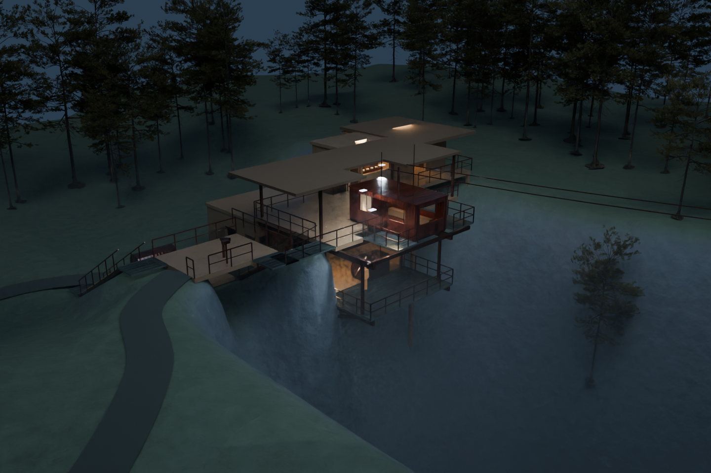
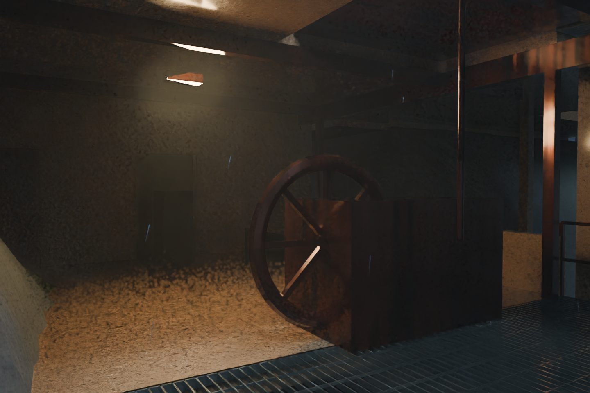
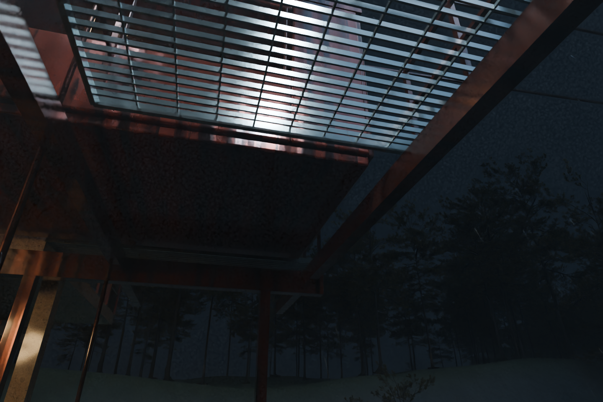
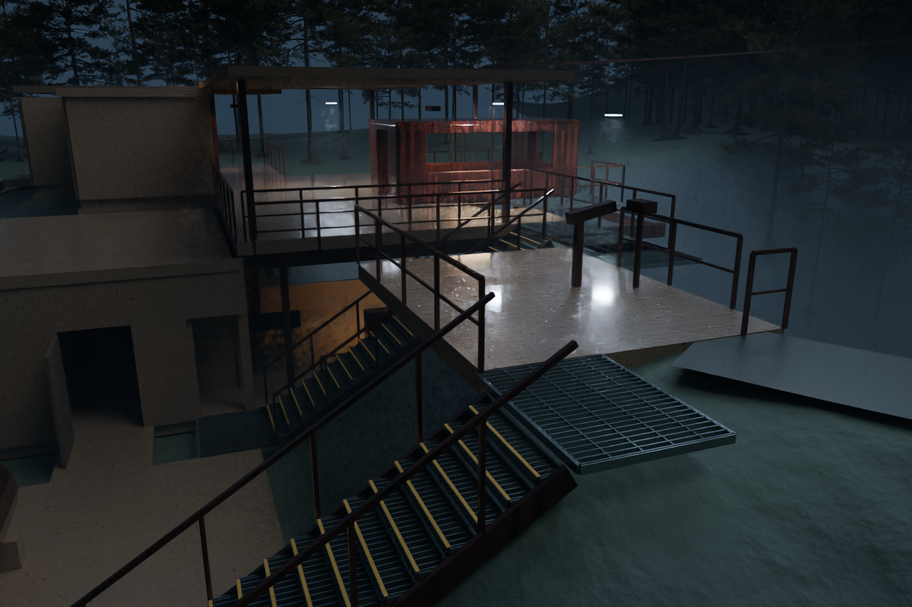
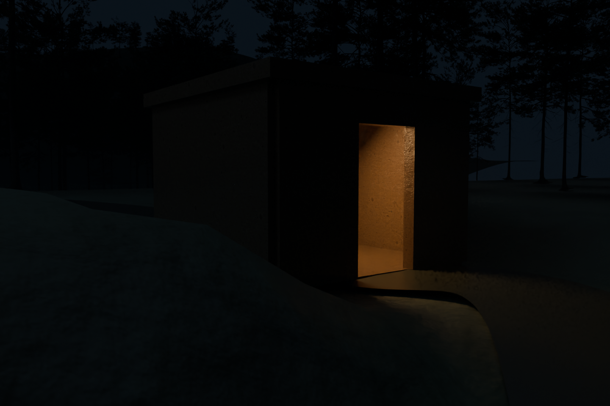
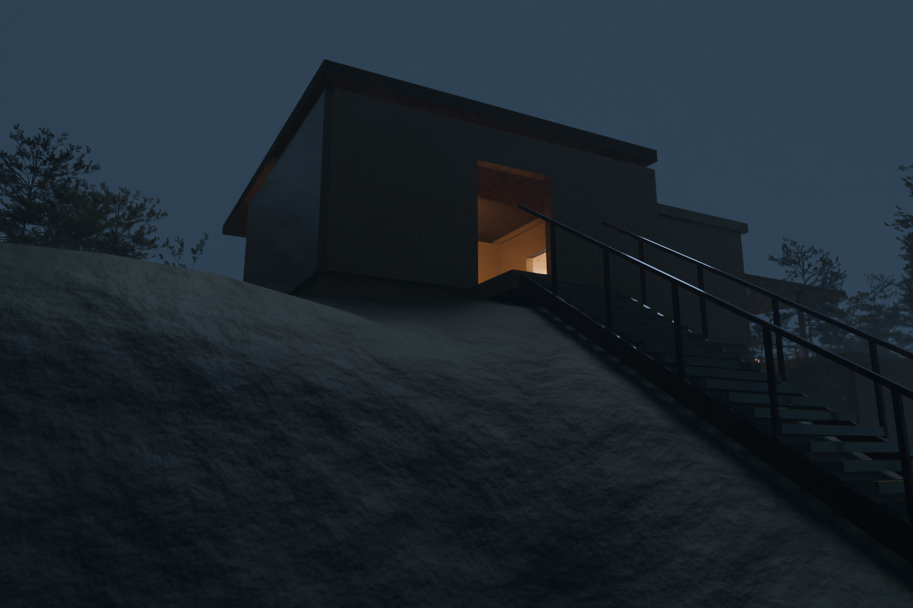
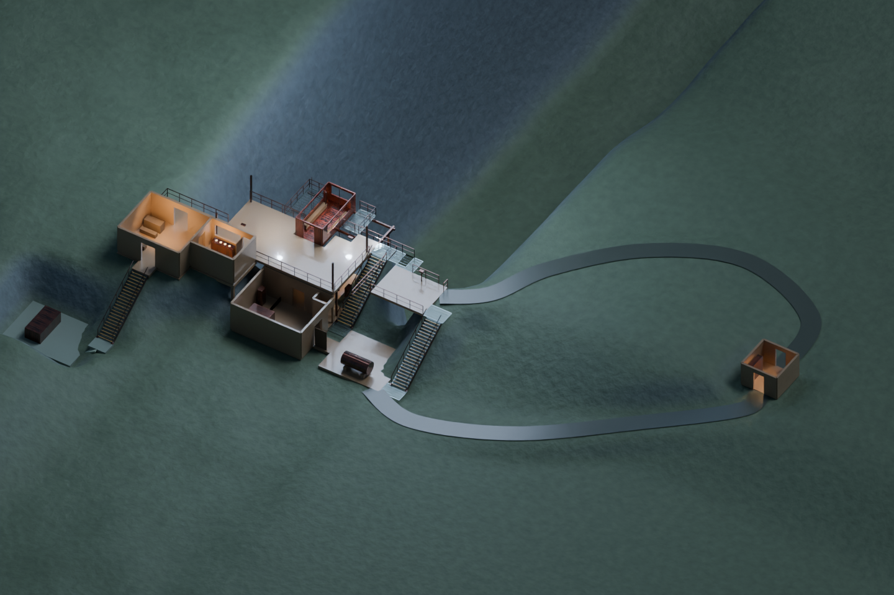
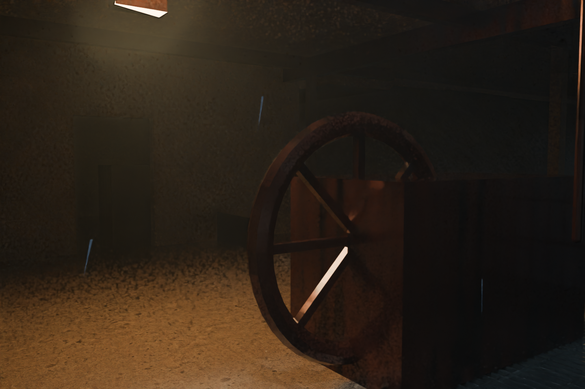

# Revision 03 — map tour

Rendered from the saved night study, without changing its geometry or saved lighting. Blue-hour images temporarily increase the sky/moon fill to show layout. The cutaway hides roofs, forest, fog and distant route geometry. Trees immediately around a camera are hidden for that shot only. Scale figures are hidden in the machinery close-ups.

| Render | What it shows |
|---|---|
| [Cliff station](01_cliff_station.png) | The station and gondola projecting over the gorge. |
| [Open drive](02_open_drive.png) | The exposed flywheel gallery and maintenance apron. |
| [Under gondola](03_under_gondola.png) | Player-height view toward the gondola overhead. |
| [Stairs and overlook](04_stairs_overlook.png) | Steel flight, landings and upper overlook connection. |
| [Relay approach](05_relay_approach.png) | The recessed relay building approached through the woods. |
| [Arrival](06_arrival.png) | Parking-side arrival and climb to the station. |
| [Site cutaway](07_site_cutaway.png) | The room layout, surrounding terrain and relay path loop. |
| [Drive machinery](08_drive_machinery.png) | Close view of the flywheel and motor study. |

Existing companion views are in `../previews/`: platform rain, control-room window, cable route toward Maldek, and wider relay/terrain views.

`shots.json` records camera positions, targets and lighting modes. Run `scripts/render_tour.py` with this revision's `.blend` loaded in a separate Blender process to reproduce the tour. It saves PNGs only; it does not overwrite the source scene. Its current device setting is CPU for the Mac run—configure GPU rendering before using it on the Windows RTX machine.

## Render gallery

### Station over the gorge

### Exposed drive gallery

### Below the gondola

### Stairs and overlook

### Relay approach

### Arrival

### Site cutaway

### Drive machinery

