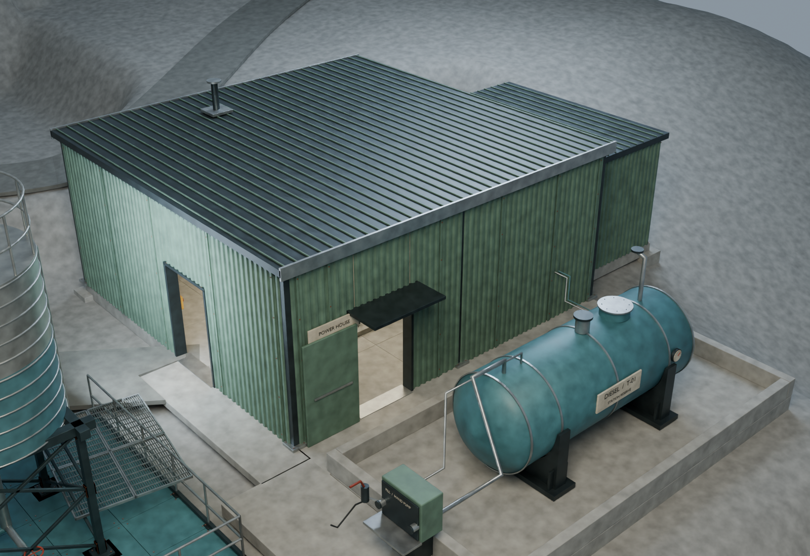
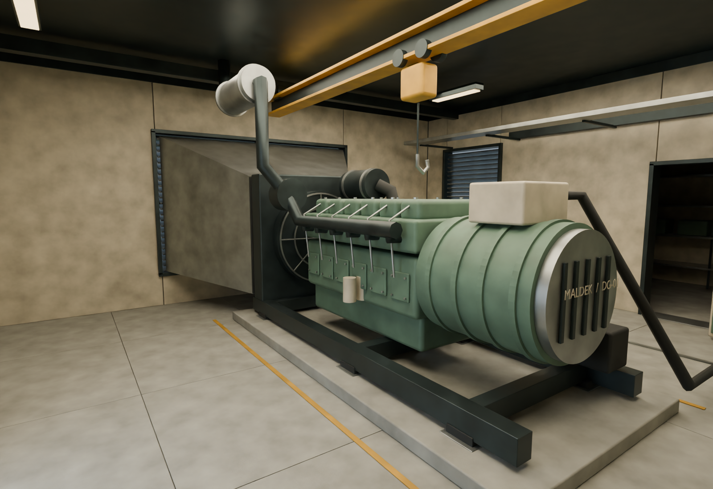
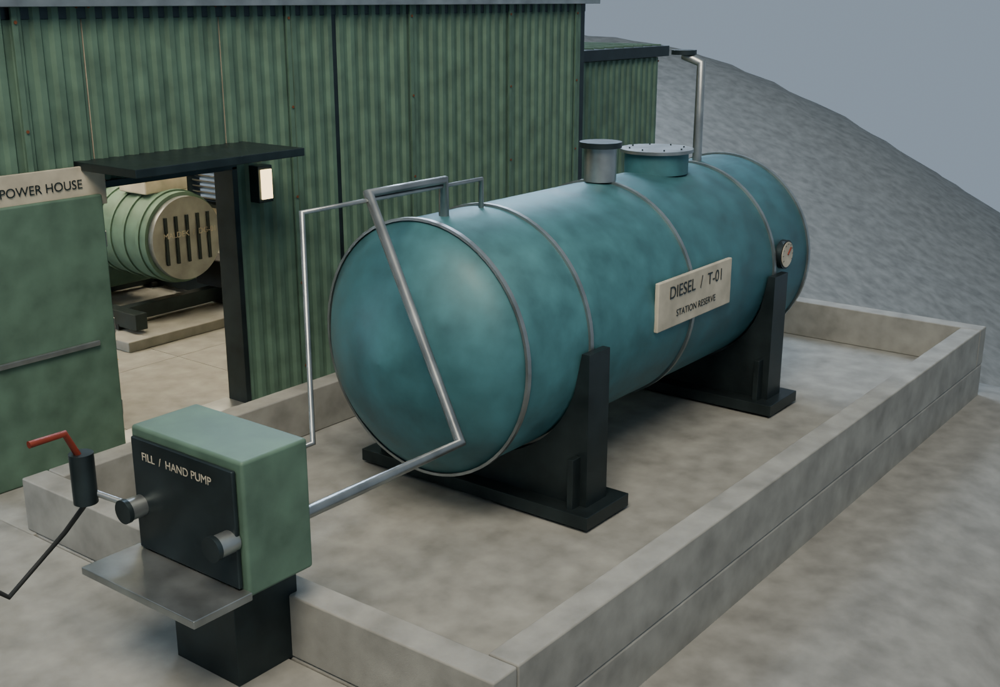
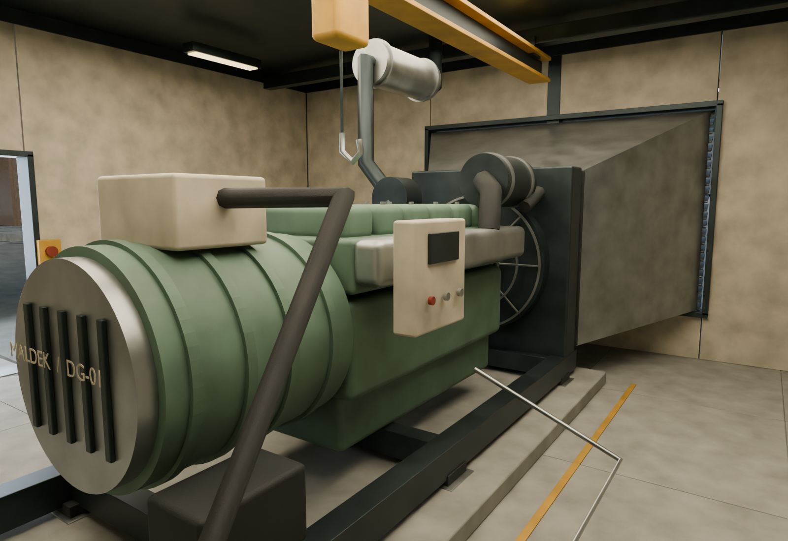
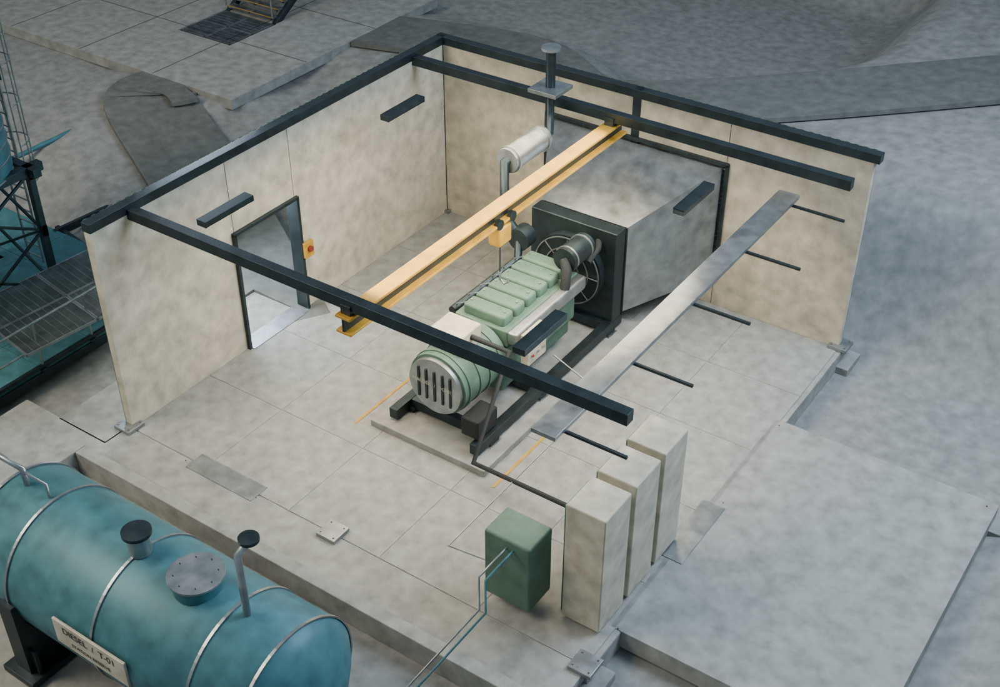

# VF08 review images

The Blender scene contains the whole station. These are focused, neutrally lit art-review renders; they do not represent final Unreal night lighting.

## Generator and fuel yard

## Generator interior

## Fuel filling point

## Machine service side

## Cutaway

