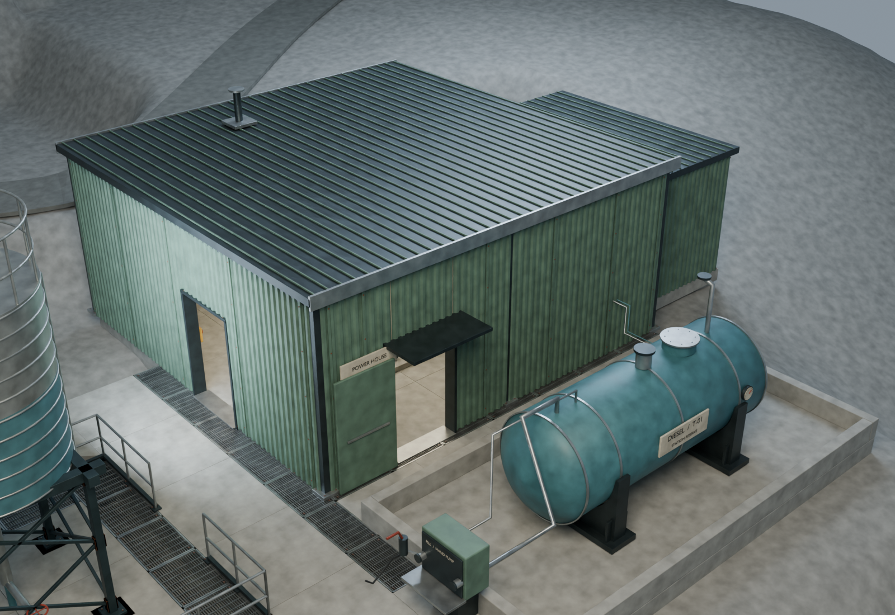
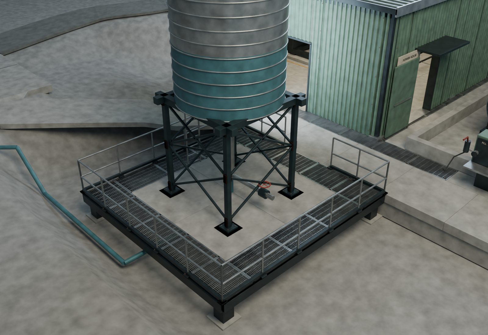
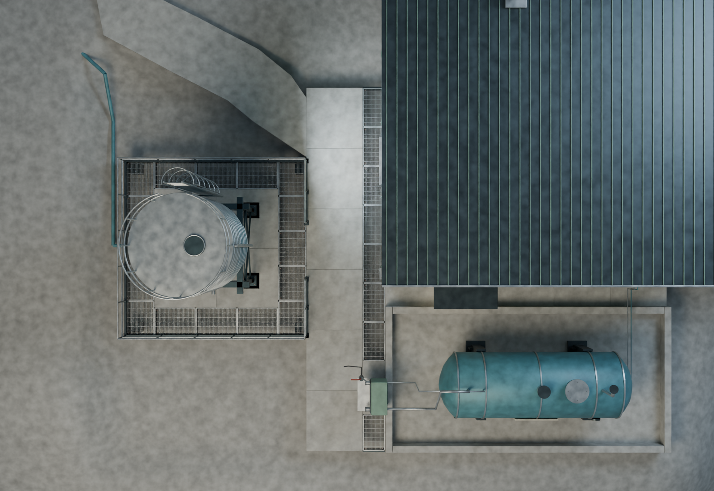

# VF09 — connected service apron and water-tank border

Open `Maldek_Service_Apron_Refinement.blend`. This is the complete VF08 station with the generator/fuel/water perimeter cleaned up. The generator and tank designs remain unchanged.

## Changes

- Removed the old skewed water-tank grating bridge and separate overlapping walkway patches.
- A two-metre concrete service walkway now connects the generator entrance, water-pad gate and emergency filling position at one floor elevation (-1 m).
- Rebuilt the water terrace around a concrete core with a regular one-metre open-grating border. Matching grating runs along the generator wall, with a narrower drain strip along the south facade. The fill cabinet has a deliberate concrete standing bay.
- Reused the station's galvanized open-grating construction, steel edge channels and tubular guards. There are no opaque backing plates directly beneath the grate cells.
- Replaced scattered exposed feet with continuous recessed concrete foundations and orderly water-pad supports. Terrain is lowered beneath the open grating and blended around the footprint.
- Replaced the final service-road section so it meets the straight apron boundary. The water main drops below the walking surface at the terrace; the existing wall valve remains.

## Review images

These are Blender inspection renders, not Unreal night-lighting screenshots.

## Verification and handoff

`verification.json` checks the seven inherited generator/fuel routes, three water-pad routes and the incoming sloped service road against evaluated visible geometry. Floor probes search a 70 mm patch at 5 mm intervals when a ray falls between grating bars; body probes check 560 mm clearance. All checked routes pass. This is sampled Blender verification, not a continuous Unreal capsule sweep.

The same report compares the preserved generator, diesel-tank and water-tower mesh bounds against VF08. `layout.json` records the exact replacement scope, non-overlapping surface rectangles and pipe/road centerlines.

Rebuild with Blender 5.0.1 using `scripts/build_apron.py`, then `scripts/verify_layout.py` and `scripts/render_review.py`. The builder reads VF08 and writes only VF09. Existing Blender files and Unreal assets are untouched. A future Unreal transfer must include the apron, road connection, foundations, water-pipe and local terrain changes together.
