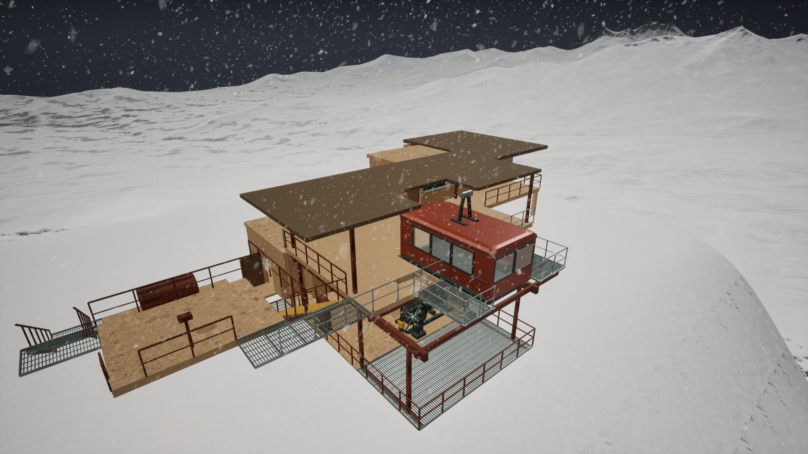
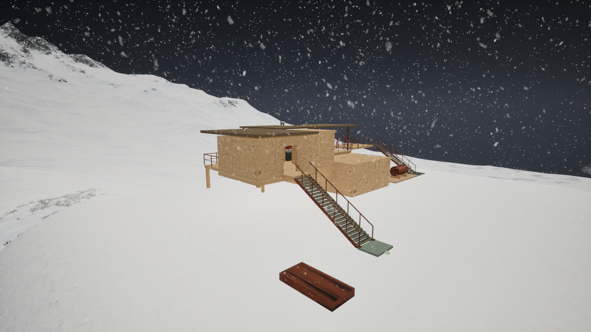
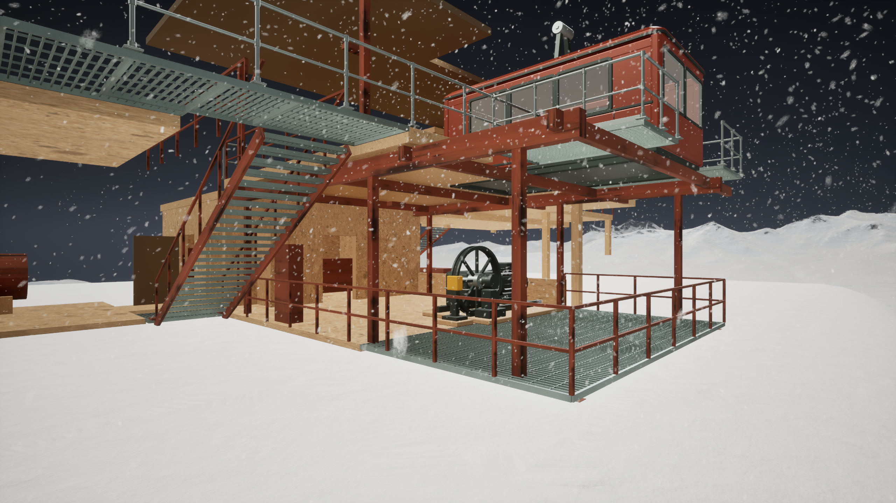
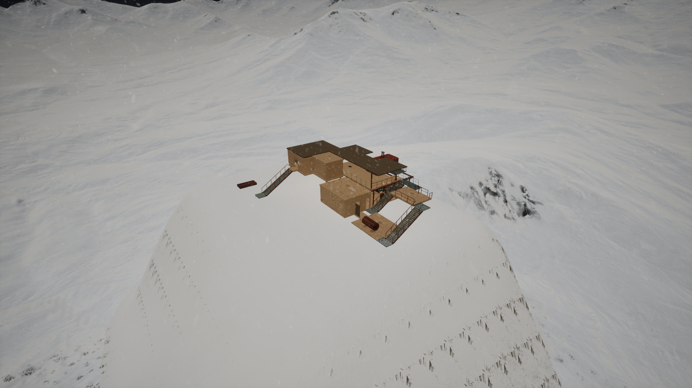
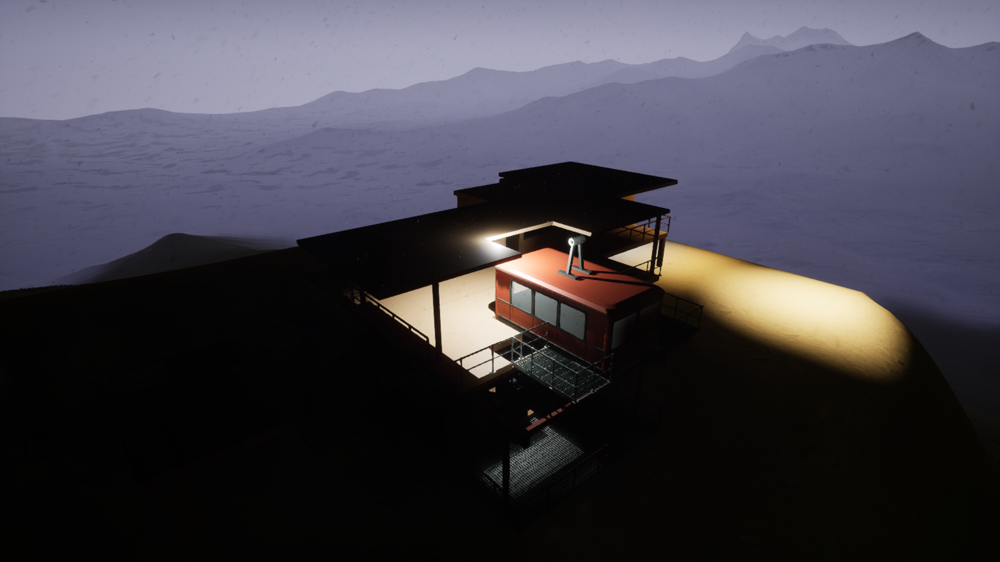
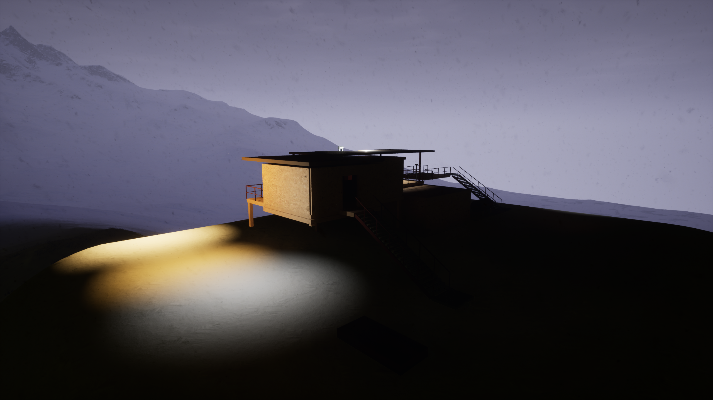
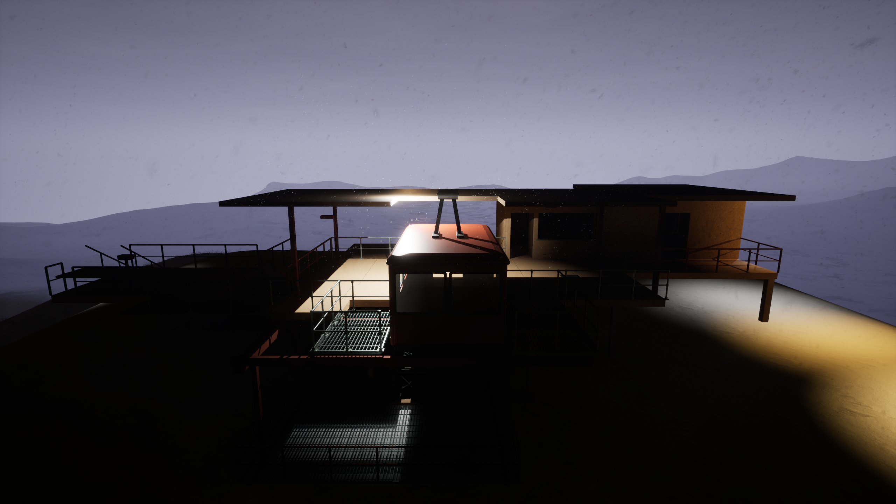
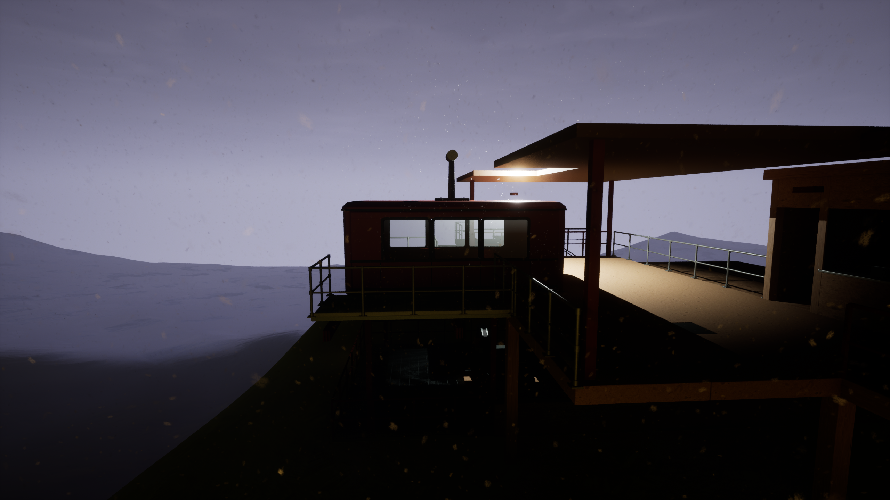
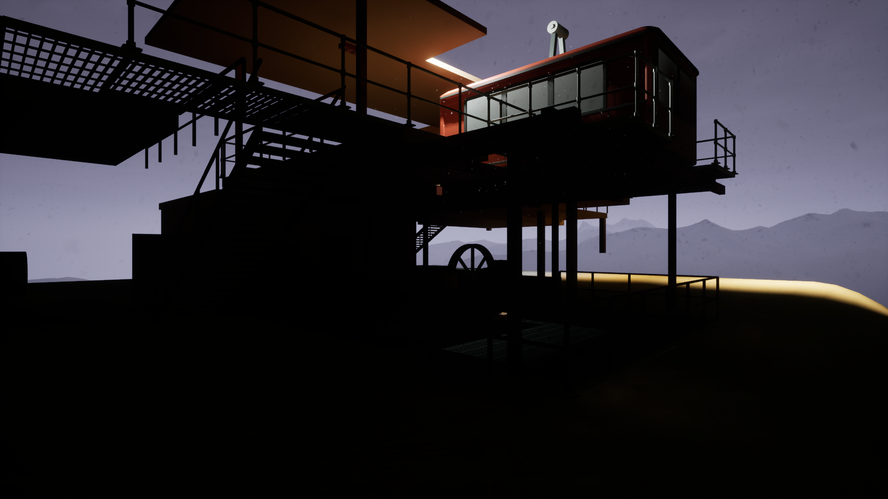
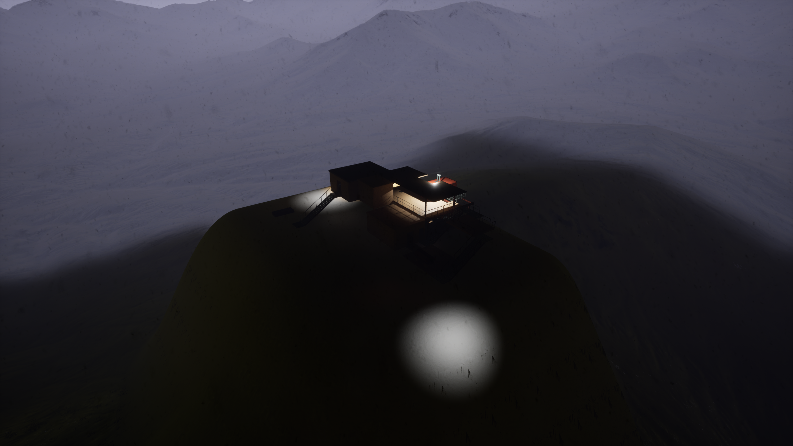

# Station views — Unreal R04

2560 × 1440 captures from the actual `BlockOut_R04` level. The level was not saved or modified by these rendering sessions.

## Brighter inspection views

Temporary neutral fill lights make the structure and terrain readable. These show the current geometry, but are not the saved game lighting.

### Overall station

### Arrival and stairs

### Lower drive and platform structure

### Terrain context

## Night views

Existing level lighting, with a temporary +2-stop exposure bias for these captures.

### Overview

### Arrival

### Gondola from the front

### Along the platform

### Lower structure

### Wide terrain

