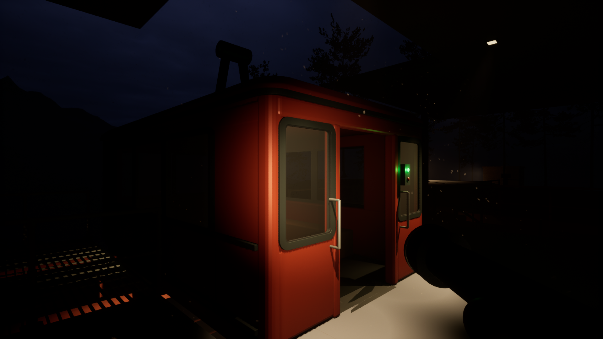

# R09 — playable station review

Open `/Game/MaldekRefinement/R09/BlockOut_R09` in `game/game.uproject` (Unreal Engine 5.7).

- WASD and mouse: walk and look. Shift: sprint. Space: jump. Flashlight starts on.
- A camera-mounted prototype glove and flashlight replace the unarmed first-person mesh. The beam is narrow, warm-neutral and deliberately dim (0.2 lumens, 6.5 m attenuation radius). These are simple proxy meshes, not finished character art or animation.
- The visible gondola is detached with its world transform preserved and made static. The hidden legacy carrier has no collision. Its original route code remains available for future gameplay; it cannot carry the visible cabin away.
- One soft cabin ceiling fixture and two focused canopy downlights have visible housings. A small green boarding indicator is illuminated; the red lens remains off in this parked review state. Existing night lighting and fog remain in place.
- 55 nearby pines are taller and slightly wider, with roots unchanged, to frame more of the sky above the deck. 91 trees whose original tops were below the lower deck were removed, leaving 69 pines. This reduces instance count; 1440p/60 FPS performance has not been benchmarked.
- The user's removal of PointLight2 and PointLight5 was saved in R08 before creating R09 and is preserved here.

## Verification

The saved R09 map was reloaded and tested in Play. The correct pawn spawned with walking movement, the 0.2-lumen flashlight and held mesh components. Simulated movement displaced the pawn by 333 cm. Forcing the old controller through a one-second departure and return cycle produced zero visible cabin translation or rotation over nine seconds. See `play_verification.json`.

## Reproduction

With R08 or R09 open and Play stopped, run the scripts in `../scripts` through Unreal's Python console in this order: `start_r09.py`, `setup_r09_character.py`, `refine_r09_trees.py`, `place_r09_practicals.py`. `tree_baseline.json` preserves the original foliage transforms for repeatable updates. Run `playtest_r09.py` for the in-editor regression check; it leaves a test Play session running. `restart_r09_review.py` captures the current player view and starts a fresh Play session afterward.
